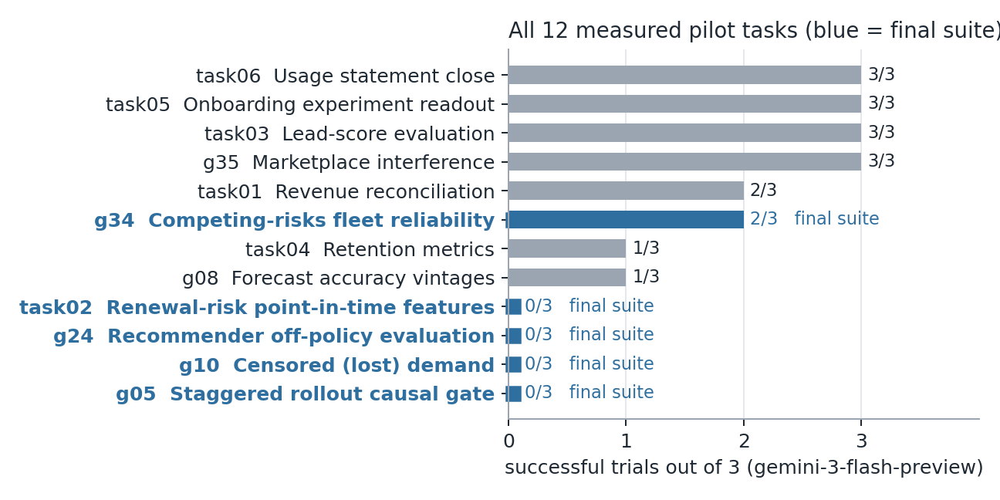
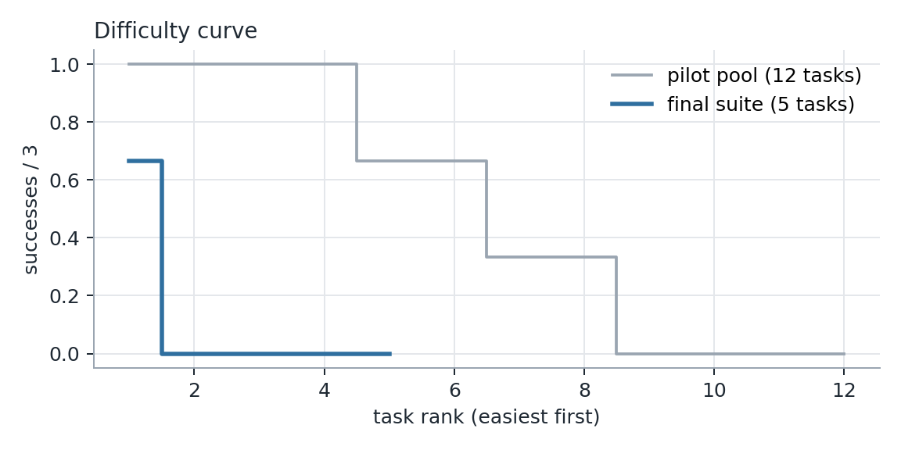
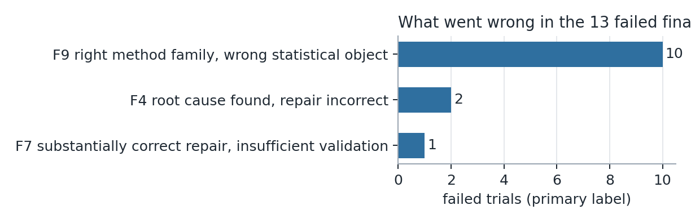

# ForensicDS: Does the Agent Compute the Right Number?

A five-task Harbor eval of statistical-object preservation in enterprise decision analytics.

Target model: `google/gemini-3-flash-preview` via `gemini-cli`, Harbor 0.21.0.

---

## Executive summary

Most data-science benchmarks check that an agent produces *an* answer: a leaderboard score, a query
result, a closed-form value. In industry, the expensive failures are different. The pipeline runs, the
number looks plausible, the recommendation is defensible — and the number estimates the wrong thing.

**ForensicDS** targets that failure. Each task hands the agent a working enterprise analytics pipeline,
a business decision that depends on its output, and evidence that something is off. The agent must:

- work out which statistical object the decision is actually defined on;
- repair the pipeline so it computes that object;
- make the repair hold on unseen data extracts.

**The final suite has five tasks**, curated from **12 measured pilot tasks** and a larger set of designs
rejected before any model was run.

| | final suite (5 tasks) | full pilot pool (12 tasks) |
|---|---|---|
| successful trials / trials | **2 / 15 (13.3 %)** | 18 / 36 |
| tasks with pass@3 = 1 / tasks | **1 / 5 (20 %)** — meets the < 30 % bar | 8 / 12 |

**Main finding.** Gemini 3 Flash is usually right about *what kind* of problem it faces: point-in-time
leakage, censoring, off-policy evaluation, staggered rollout, competing risks. It rebuilds the
operational data state correctly, then computes a **different statistical object** from the one the
decision needs:
- the wrong conditioning set;
- the wrong action space or decision unit;
- a mis-modelled censoring mechanism;
- censored units counted as survivors.

10 of the 13 failed trials are of this kind. In 5 of the 13, the business decision it reached was
correct anyway (F10). **No failed trial ran a falsification check** (placebo, pre-trend, held-out
comparison or explicit assumption test) before stopping. Their checks were coherence checks: the
pipeline runs, NaN counts, outcomes sum to one, or agreement with a trusted number.

---

## 1. Distribution: what we measure and why

### The slice
We measure **decision analytics on enterprise operational data**. An organisation already has a number
and a pipeline that produces it; a decision (ship, invest, procure, launch) rides on that number; and
the number is wrong for a *statistical* reason, not a crash.

The agent works as the data scientist asked to sign off:
- inspect the evidence (warehouse extract, code, docs, prior reports);
- identify the estimand the decision is defined on;
- repair the pipeline;
- produce the correct number;
- say why the old one was wrong.

We chose this slice for three reasons.
1. **It is the work.** Much applied DS in industry is auditing and repairing existing analyses rather
   than modelling from scratch. Each task is modelled on a failure class that recurs in practice:
   - point-in-time leakage from a migrated feature pipeline;
   - two-way fixed effects misused under staggered adoption;
   - lost-sales estimation under stock-outs;
   - off-policy evaluation of a recommender;
   - Kaplan–Meier used where a cumulative-incidence function is needed.
2. **It isolates one capability**: preserving the exact statistical object through a multi-step
   repair. Every task has a *recognisable* surface problem and a harder object-level problem beneath it.
3. **It is gradable deterministically.** Each task has a generator with a known latent world, so the
   verifier compares the agent's numbers to truth on the visible extract and three hidden extracts,
   with tolerances calibrated from the sampling error of a correct estimator.

### In scope
- tabular enterprise data (SQLite warehouses, logs, registries);
- Python analytics packages;
- causal and statistical estimands;
- business decision rules;
- messy evidence: stale reports, misleading notes, dashboards, SOPs.

### Out of scope
- leaderboard-style model training;
- unstructured or multimodal inputs;
- visualisation;
- open-ended "insight" questions that need an LLM judge.

A deterministic verifier over latent truth was a deliberate choice: it lets us argue failures are real
rather than grader noise (§6).

### Where the distribution comes from
Each task is a parameterised *world generator* plus an *incumbent pipeline*:

| task | real-world source pattern | graded statistical object |
|---|---|---|
| **Task02** renewal-risk regression | feature-store migration breaks point-in-time joins (training/serving skew) | features as loaded before each prediction date; model metrics on correct features |
| **G05** self-checkout rollout gate | staggered retail rollout evaluated with store + week fixed effects | wave and gate effects conditional on format-specific trends (valid staggered-adoption identification) |
| **G10** censored demand | replenishment planning from stocked-out sales | latent demand and lost units under *informative* censoring |
| **G24** recommender OPE | launching a ranker from logged exploration traffic | slot-level IPS policy values with the correct action space and decision unit |
| **G34** fleet reliability | spare-parts procurement from field-failure data | cumulative incidence under competing overhaul / retirement (not Kaplan–Meier) |

In each case the business decision depends on the graded quantity, and the generator encodes the
mechanism that makes the incumbent number wrong.

---

## 2. The task suite

All five tasks share one contract shape:
- the agent must leave a working `python -m <pkg> <cmd>` that writes specified outputs;
- the verifier runs that command itself, as an unprivileged user, on the visible extract **and three
  hidden extracts** built by the same generator under different regimes;
- it checks exact bookkeeping, the statistical quantities within calibrated tolerance, and the
  decision;
- reward is **binary**: 1 only if every check passes.

| | Task02 | G05 | G10 | G24 | G34 |
|---|---|---|---|---|---|
| domain | B2B SaaS renewals | grocery retail | convenience retail | media / recommendations | industrial aftermarket |
| decision | trust / retrain the renewal-risk model | release tranche 2 of a rollout | category buy plan | launch ranker v7 or v7-pd | expanded vs baseline spares build |
| surface trap | CRM/health features read today's state | basket-size and TWFE readouts | forecasts treated as demand | replay "A/B" gate | 55 % "failure" figure |
| object the decision needs | state as loaded before each prediction date | format-conditional wave / gate effects | demand with informative-censoring correction | slot-exact IPS, eligible-set action space, TTL decision unit | 36-month CIF of unplanned failure |
| hidden extracts | 3 | 3 | 3 | 3 | 3 |
| mutation / wrong-method suite | 21 / 21 as expected | 38 / 38 | 33 / 33 | 30 / 30 | 21 / 21 |
| Oracle / Nop | 1 / 0 | 1 / 0 | 1 / 0 | 1 / 0 | 1 / 0 |
| Gemini 3 Flash | 0 / 3 | 0 / 3 | 0 / 3 | 0 / 3 | 2 / 3 |

Short descriptions follow; full task details are in Appendix A.

- **Task02 — renewal-risk regression.** After a warehouse migration, the renewal-risk model's offline
  AUC jumped to 0.93. The feature pipeline now joins current-state CRM and customer-success tables, so
  every historical example sees information loaded after its prediction date. The correct repair
  reconstructs each feature as loaded (`synced_at`) before 00:00 UTC on the prediction date. That covers
  renewal opportunities, stages, amounts, expansion pipeline and health scores, under late-arriving
  and re-synced records.
- **G05 — self-checkout (SCO) rollout gate.** The CFO needs the business-case gate figure for tranche 2.
  The programme team's basket-size readout and FP&A's TWFE net-sales check disagree. Waves were
  sequenced by store format, and untreated formats trend differently, so the gate is only identified
  conditional on format. The kit transport step is also required.
- **G10 — censored demand.** Sales stop when a SKU sells out, so recorded sales under-state demand, most
  of all on high-demand days (informative censoring). The buy plan, the lost-sales estimate and a
  holdout programme's impact all depend on latent demand, which needs:
  - exposure-aware (in-stock hours) estimation;
  - a within-day demand profile;
  - a stochastic model with day-level overdispersion.
- **G24 — recommender off-policy evaluation.** The launch decision needs policy values estimated from a
  small randomised exploration stream. Three semantics are easy to get wrong: the propensity is over
  the *eligible* items (not the pre-filter pool), a decision spans cached re-serves (TTL), and clicks
  are credited by slot.
- **G34 — fleet reliability.** The procurement rule is written on the 36-month *cumulative incidence*
  of unplanned failure, given overhaul and retirement as competing events. The published 55 % figure is
  Kaplan–Meier, which answers engineering's latent-life question, not procurement's. Censoring must
  be handled, not counted as survival.

---

## 3. Evaluation protocol

- **Command.** `harbor run -p samples/<task> -a gemini-cli -m google/gemini-3-flash-preview -k 3 -n 3`.
  Exactly three valid trials per task.
- **Invalid runs** (infrastructure failures: API key or quota errors, agent-setup timeout, a verifier
  that never executed) are recorded separately and never counted. Such runs occurred during the Task01,
  G08 and G05 baselines. For G05, one trial whose verifier never ran was adjudicated invalid *before*
  its replacement was launched. The adjudication records its outcome as "would have scored 0", so it
  cannot change any conclusion (Appendix C).
- **Freezing.** Each task was frozen (content checksum recorded) before its baseline, and none was
  modified afterwards. Harbor's durable task content digest (`lock.json`) is identical across all three
  counted trials and the Oracle and Nop runs repeated for this report (Appendix B).
- **Verifier hardening.**
  - the agent's pipeline runs as uid 65534 with `/tests` unreadable;
  - interpreter and standard-library hashes are checked against a manifest;
  - the warehouse is compared to a pristine regeneration;
  - hidden extracts come from generators the agent never sees;
  - tolerances are a multiple of the Monte-Carlo standard error of an accepted estimator, calibrated
    before any model run.
- **Quality checks.** Oracle = 1 and Nop = 0 on the frozen checksum. Mutation suites of 21–38 cases,
  covering valid alternative estimators, wrong statistical objects, overfits and tamper attempts, all
  behave as expected. `harbor check` was run on every task: all 11 default-rubric criteria pass. We also
  ran the **TB3 task-implementation rubric** (35 criteria), recovered from the TB3 repository's git
  history because the assignment's link now returns 404. Each task fails 5–10 TB3 criteria, all
  reported in Appendix B:
  - **TB3 platform conventions:** separate verifier image, `task.toml` schema, category/tags, task
    name, expert-time field.
  - **Instruction style:** memo framing, relative paths.
  - **Verifier hardening:** no `--no-new-privs`; the reward directory is not explicitly `chmod 700`;
    Task02's verifier runs the agent's pipeline as root; pytest is installed at verify time (from PyPI
    for Task02 and G10).
  - **Metadata explanation text.**

  One TB3 finding is incorrect for this setup. It says G34's `/tests` is readable during the agent
  session, but Harbor 0.21 uploads `tests/` only inside `verify()`, after the agent finishes, and no
  task image copies `tests/` or `solution/`. **None of these gaps affected a measured result.** No
  counted trajectory references `/tests`, `/solution`, `test.sh` or the reward files, and every
  failure is a numeric failure. The tasks are frozen and baselined, so we report these gaps rather
  than patch them; they would be fixed in a v2.

**Terminology.** "Successes / 3" is an empirical per-attempt success rate from three trials (an estimate
of pass@1 with wide uncertainty, not an exact pass@1). **pass@3** for a task is 1 iff at least one of
its three trials passes. Aggregate pass@3 is the fraction of tasks with pass@3 = 1.

---

## 4. Results

| task | trials (reward) | successes / 3 | pass@3 | model cost |
|---|---|---|---|---|
| Task02 | JctTpSi 0 · nXXMdDm 0 · pf9zaPc 0 | 0 / 3 | 0 | $0.70 |
| G05 | MMGNYFS 0 · PYhR2eh 0 · rsDKTXQ 0 | 0 / 3 | 0 | $0.60 † |
| G10 | LhEU3ny 0 · cLtM9yi 0 · eMXZbBi 0 | 0 / 3 | 0 | $0.58 |
| G24 | a8zVL7h 0 · wVmAykK 0 · ykNY8fD 0 | 0 / 3 | 0 | $0.51 |
| G34 | SdvVPQN 1 · UPCLpLx 0 · hLbWzqK 1 | 2 / 3 | 1 | $0.12 |
| **total** | | **2 / 15 = 13.3 %** (Wilson 95 %: 3.7–37.9 %) | **1 / 5 = 20 %** | **$2.53** |

† Includes the invalid trial.

**The difficulty curve is sharply bimodal.** Across the 12 measured pilot tasks:

| outcome | tasks |
|---|---|
| solved every time (3/3) | four |
| 2/3 | two |
| 1/3 | two |
| never solved (0/3) | four |

The final suite keeps the four 0/3 tasks. As its single calibration anchor it adds **G34**, chosen over
the other anchor candidates on validity grounds: its failing trial is a clean, isolated example of
the target failure (§6), and its verifier passed a post-baseline semantic audit.

**Selection caveat.** The suite was selected using the same trials we report. The 20 % figure is
therefore an optimistic (low) estimate of the suite's pass@3 on fresh draws (§10).

---

## 5. What kinds of failures dominate

Primary labels for the 13 failed final-suite trials use a taxonomy fixed before the baselines:

| label | trials | meaning |
|---|---|---|
| **F9** | 10 / 13 | right method family, wrong statistical object |
| F4 | 2 / 13 | root cause found, repair incorrect (Task02) |
| F7 | 1 / 13 | substantially correct repair, insufficient validation (Task02) |

**Decision right, quantities wrong (F10)** appears in 5 of the 13 failed trials:
- G24: 3/3, every launch correct on all four extracts;
- G05: 2/3, "stop" was correct.

A decision-only grader would have scored those trials as successes.

---

## 6. Trajectory failure analysis (bonus)

These trajectory findings come from full reading of every ATIF trajectory, re-running each agent's
**submitted code** on pristine extracts, and targeted counterfactual patches on analysis copies. Per-task
write-ups are in `report/supporting/`.

### Task02 — found the leak, rebuilt the wrong state (0/3)
All three trials went straight to the point-in-time hypothesis. One reasoned explicitly that
"`changed_at` could precede the `prediction_date` even if `synced_at` is later … leaning toward
`synced_at < prediction_date`." All three then implemented history reconstruction with
**grouping-key errors**:
- expansion-opportunity state keyed once per opportunity instead of per (entity, prediction date);
- in two trials, record existence also tested on CRM time rather than load time.

Validation stopped at "AUC 0.77, close to the previous model version"; no example-level check was
done. **Why these are genuine failures:**
- re-running each agent's code reproduces the verifier's mismatch counts exactly;
- in JctTpSi, correcting only the grouping keys makes every feature match the reference on all four
  extracts;
- no trial failed only on hidden extracts.

### G05 — rebuilt the panel exactly, never asked what identifies the effect (0/3)
All three valid trials reconstructed the analysis panel **exactly** on all four extracts: actual
go-live, event time, comparability, log net sales. All three then fit store + week fixed effects with
no format conditioning. None discovered that waves were sequenced by format; none ran a pre-trend or
placebo check.

In `rsDKTXQ` the agent wrote that including kit type "seems essential" and then chose the pooled
estimate because "the 'stop' recommendation based on this is safe." That is estimand selection
driven by decision robustness. Two of three trials reached the correct decision with every graded
effect 1.1–7.6 τ (tolerance units) out of tolerance.

### G10 — recognised censoring, mis-modelled it (0/3)
All three recognised censoring, and two stated that the sell-out days are high-demand days. None
modelled the day-level demand shock that makes censoring informative:
- **LhEU3ny** imputed lost sales from the forecast.
- **cLtM9yi** used a plug-in at a pooled rate.
- **eMXZbBi** scaled each day independently.

Errors were 9.7–68× tolerance. In a counterfactual, adding an overdispersion posterior to cLtM9yi's
code removes ~70 % of its error, but it still fails: G10 is **several** correct statistical decisions
deep, not one.

### G24 — correct estimator family, wrong object (0/3)
All three rejected the replay gate for the right reason and chose slot-exact item-in-slot IPS on the
exploration stream. They then applied it to the wrong object:
- two used the pre-filter pool size as the action space;
- all three mis-defined the decision unit (cached re-serves).

Two submissions are numerically identical to pre-registered mutations
(`wrong_weight_pre_filter_pool`, `wrong_keep_first_serve`). Patching ykNY8fD's decision grouping
(~25 lines) makes it pass every check on all four extracts. a8zVL7h needs two such patches (action
space and decision anchor). The failures are one or two semantic steps from correct, which shows the
verifier is not over-strict.

### G34 — the discriminator is whether the agent reasons about the risk set (2/3)
The failing trial (UPCLpLx) reached the right framing: it said Kaplan–Meier answers engineering's
question and cumulative incidence answers procurement's. It then divided raw event counts by the
whole installed base, counting every unit censored at the extract cut-off as "still original". Its
Q1 of 0.2757 fell below the 28 % trigger and flipped the procurement decision.

It did more tool calls and read more documents than either passing trial. The difference: it used
the concept of censoring **zero** times; the two passes used it five times each. A zero-model-call
semantic audit confirmed the grading:
- every one of 14 plausible wrong interpretations is rejected on all four extracts;
- every legitimate estimator passes;
- the failing trial matches exactly the "censored counted as surviving" interpretation, which the
  contract rules out.

### Cross-task findings
1. **Recognition is not the bottleneck; object preservation is.** In every failed trial the agent
   identified the broad problem class. The failures appear at the step where a named concept must be turned
   into a specific estimand: conditioning set, action space, decision unit, risk set, or as-of key.
2. **Agents stop when the analysis is coherent or decision-plausible, not when it has been tested.**
   The failed trials include no pre-trend, placebo or held-out check, and no assumption test. Across
   tasks the stopping signal was one of:
   - agreement with a trusted external number (G24's A/B sign, G10's positive trend);
   - self-consistency and defensibility (G05).
3. **Decision-level grading would hide most of this.** 5 of 13 failures reach the right decision. The
   verifiers therefore grade quantities *beneath* the decision; that choice was made before baselines
   and is justified here.
4. **Failures are near misses, not chaos.** Several trials are one targeted patch from a pass (G24
   ykNY8fD, Task02 JctTpSi). The G10 counterfactual shows its trials are several such patches away.
   That is what genuine difficulty looks like, and the opposite of what ambiguous instructions or a
   broken environment would produce.

---

## 7. How the suite was curated, and what we rejected

The assignment encourages piloting more tasks than you ship. We measured **12 tasks** (36 trials, 18
successes) and shipped 5.

| excluded measured task | why excluded |
|---|---|
| Task01, 03, 05, 06, G35 | solved 2/3–3/3; no headroom |
| Task04 (1/3), G08 (1/3) | valid tasks; including more than one pass@3 = 1 task pushes a 6-task set to ≥ 33 %, and G34 is the better-validated anchor |
| **G36** | **contaminated**. After its baseline, an adjudication found the verifier graded a household-weighted response the contract describes as load-weighted (a verifier defect, F8). Its 0/3 is **not counted** |

Beyond the measured pool, **more designs were rejected before any model run**. We kept the evidence,
because it shows what makes a DS task *gradable*.

| design | intended phenomenon | failure | caught by |
|---|---|---|---|
| G31 | selective labels in fraud chargebacks | a label-free heuristic recovered every decision; two of three intended mechanisms inert | adversarial review, cheap-solve search |
| G33 | entity resolution | constant decision correct in 54/60 worlds; wrong entity mappings within 0.004–0.016 (absolute share) of truth | kill criteria |
| G37 | measurement-system change (errors-in-variables) | valid-estimator noise ≈ size of subtle wrong methods (window ratio 0.01) | pre-registered tolerance window |
| G38 | regression to the mean under threshold-triggered intervention | irreducible counterfactual noise; naive dashboard only ~2 SE away at a realistic trigger (ratio ≈ 0) | pre-registered tolerance window |
| G39 (12 concepts) | deterministic optimisation, normalisation, aggregation | wrong objects coincide exactly whenever their trap is inactive; pinning the definition pins the computation | separation and counterexample gates |
| G40 | challenger model at a fixed investigation budget | near-miss estimators inside legitimate noise (ratio 0.61) | separation gate |

**The general lesson.** A statistical phenomenon can be real, industry-relevant and identifiable, and
still be **ungradable**. That happens when plausible wrong analyses land inside the uncertainty of
correct ones. The gates we developed during the project (mostly after G36) now apply to any new
task *before it is built*:
- a measured valid/wrong separation (worst plausible wrong error ≥ 3× the valid bound);
- a counterexample search;
- a natural-implementation-path audit;
- an independent derivation of every graded quantity.

The shipped tasks predate the strictest form of these gates. Each was built with a pre-registered
wrong-method panel, Monte-Carlo tolerance calibration and a mutation suite. G34 additionally passed a
post-baseline, zero-model-call semantic audit against the full gate set.

The surviving tasks are the ones where the wrong analysis computes a *different object* with a large
error (G10: 9.7–68× tolerance; G05: wrong routes ≥ 4.6τ vs ≤ 0.54τ for valid ones).

---

## 8. Related work (research awareness)

- **MLE-bench** (Chan et al., 2024; arXiv:2410.07095): 75 Kaggle competitions graded against
  leaderboards. It measures modelling skill against a score. We measure whether the *quantity* is the
  right one.
- **DSBench** (Jing et al., ICLR 2025; arXiv:2409.07703) and **InfiAgent-DABench** (Hu et al., 2024;
  arXiv:2401.05507): data-analysis questions with closed-form answers (DABench) and analysis plus
  Kaggle-style modelling tasks with long contexts and multiple tables (DSBench, whose best agent solved
  34 % of analysis tasks). Both grade an answer to a stated question; neither asks whether an
  organisation's existing number estimates the right quantity.
- **DSAEval** (2026; arXiv:2601.13591): 641 problems over 285 datasets with multi-dimensional
  evaluation. It finds agents strong on structured, routine analysis. Our results locate the weakness
  *inside* structured analysis, at estimand choice.
- **Data Agent Benchmark (DAB)** (2026; arXiv:2603.20576): multi-database enterprise queries; the best
  model reaches 38 % pass@1. **DataSpace** (arXiv:2608.03451), the KDD Cup 2026 data-agent track:
  verifiable tabular answers over heterogeneous workspaces. **UniDataBench** (arXiv:2511.01625) and
  **DataCross** (arXiv:2601.21403): multi-source and cross-modal analytics. All of these stress data
  *integration*; our tasks mostly pass the integration step and fail at the statistical object.
- **AvalancheBench** (Kleczek et al., 2026; arXiv:2605.24183): evaluates enterprise data agents by
  recovery of a known latent world, and reports ~26 % rubric recovery. It is the closest in spirit
  (latent-world truth); we use binary deterministic verification rather than a partial-credit
  rubric.
- **Harbor** and the **TB3 task-implementation rubric**: the task format, harness and quality rubric.
- **Methodological sources for the task mechanisms:**
  - point-in-time correctness (feature-store and training/serving-skew literature);
  - staggered difference-in-differences with heterogeneous trends;
  - censored-demand estimation;
  - Li et al.-style replay vs IPS off-policy evaluation;
  - Kaplan–Meier vs cumulative incidence under competing risks.

---

## 9. Scale plan: from 10 to 1,000 tasks

The design already factors each task into reusable parts:

**task = mechanism × domain skin × data regime × incumbent bug × decision rule**

1. **Mechanism library (~15–25 mechanisms).** Point-in-time state, informative censoring, competing
   risks, staggered adoption, off-policy evaluation, interference, forecast vintages and similar. Each
   has a generator, an oracle estimator, valid alternative routes and a wrong-object panel.
2. **Domain skins and data regimes (×10–20 each).** Retail, SaaS, logistics, energy, healthcare
   operations; varied size, noise, mix and timing. Public datasets can seed realistic marginals:
   - M5 / Favorita for demand;
   - Open Bandit Dataset for OPE;
   - Backblaze and C-MAPSS for reliability;
   - Instacart and Online Retail for transactions.

   Latent truth stays generator-controlled.
3. **Automated QA gate per variant, before any model run.** These are the gates this project built and
   used:
   - Oracle = 1 and Nop = 0;
   - mutation suite behaves as expected;
   - Monte-Carlo tolerance calibration;
   - **valid/wrong separation ≥ 3** and a counterexample search;
   - natural-implementation-path audit;
   - independent derivation of every graded quantity;
   - `harbor check`.

   In our experience about half of well-motivated designs fail these gates. That is the right place to
   spend compute, because each failure caught later costs a baseline and possibly a contaminated
   result, as with G36.
4. **Difficulty calibration.** Pilot each surviving variant with a cheap model. Keep a spread, not only
   0/3, and deduplicate by (mechanism, wrong-object signature).
5. **Human review on a sample**, focused on contract wording: the one place where an automated gate
   missed a defect (G36).

At our observed costs (≈ $0.04–0.30 per trial, ≈ $0.50 per `harbor check`), piloting 1,000 tasks × 3
trials is a few hundred dollars. The binding cost is generator and verifier engineering, which the
mechanism library amortises.

---

## 10. Limitations

- **Small n.** Three trials per task gives wide intervals: the aggregate trial rate has a 95 % Wilson
  interval of 3.7–37.9 %, and the task-level pass@3 of 1/5 has 3.6–62.4 %. The < 30 % bar is met
as a point estimate; with five tasks it cannot be established tightly.
- **Selection on the reported trials.** The suite was chosen with the same trials, so its pass@3 is
  biased low. Fresh draws would likely come out somewhat higher.
- **One model, one harness** (gemini-cli). The findings are about this configuration.
- **Synthetic worlds.** Generators give exact truth, at the cost of realism in noise structure. We
  mitigated this with enterprise-style artefacts (docs, logs, stale reports), but the data is
  simulated.
- **Binary reward.** All-or-nothing grading hides partial progress; the per-check results in the logs
  recover it.
- **Verifier hardening below TB3's bar** (§3). This cannot create false failures, and no trajectory attempted
  to exploit it, but a v2 would move to separate-verifier mode with pre-baked test dependencies.
- **AI-assisted authoring.** Tasks, verifiers and much analysis were written with Claude Code under
  explicit gates (§7). The contamination found in G36 shows gates can still miss contract/verifier
  mismatches. That is why every graded quantity now needs an independent derivation from the contract
  text.

---

## 11. What we automated

Claude Code wrote and iterated on:
- generators, incumbent pipelines, solutions and verifiers;
- mutation suites (in-container, with hash-distinctness and smoke-execution checks);
- Monte-Carlo fixture audits and tolerance calibration;
- the pre-build simulation gates (separation, counterexample and trigger/regime audits);
- trajectory scanners and counterfactual patch harnesses;
- the final packaging and audit scripts.

Every paid model run and every freeze decision went through explicit, recorded gates.

## 12. Reproducibility

- `samples/` holds the five frozen tasks.
- `logs/` holds the Harbor output of every counted trial, plus Oracle/Nop/check evidence.
- `report/data/results.json` is generated from the raw job outputs.

Reproduce a baseline with:

    harbor run -p samples/<task> -a gemini-cli -m google/gemini-3-flash-preview -k 3 -n 3
    harbor run -p samples/<task> -a oracle
    harbor run -p samples/<task> -a nop

---

## Appendix A — task details
See each task's `instruction.md`, `task.toml` (difficulty and verification explanations) and
`tests/`. Key facts:

| task | `samples/` directory | Harbor task digest (all trials, Oracle, Nop) | expert time estimate |
|---|---|---|---|
| Task02 | `02-renewal-risk-regression` | 165ade77dd2e05fe | 120 min |
| G05 | `g05-sco-rollout-gate` | d516b423252435b5 | 300 min |
| G10 | `g10-censored-demand` | b6753d713539dd54 | 240 min |
| G24 | `g24-recommender-ope` | 3db8174c4d56b0ea | 240 min |
| G34 | `g34-fleet-reliability-gate` | d364e09a2f2e2f32 | 240 min |

## Appendix B — validation evidence
See `VALIDATION.md` (generated): Oracle/Nop on the frozen checksum, `harbor check` outcomes, mutation
suites.

## Appendix C — trial IDs, invalid runs and costs
See `TRIALS.md` (generated from `report/data/results.json`).
